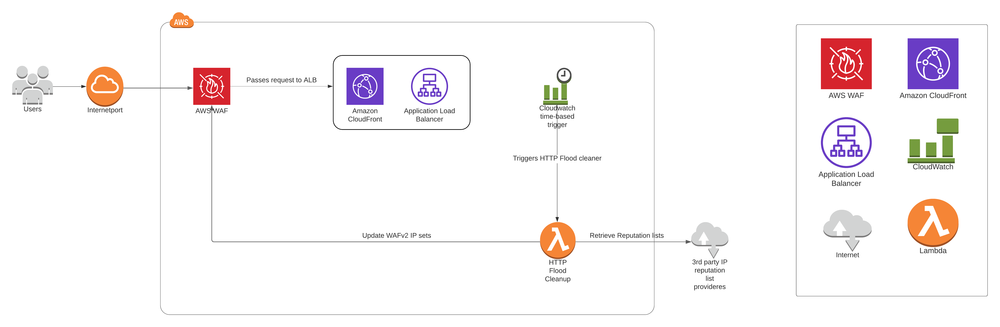

# IP Reputation List Parser

The purpose of this Lambda function is to contact third party IP reputation list providers and update the existing
WAFv2 IP sets. 

This Lambda function is part of the AWS WAF Security Automations project.

See the [AWS docs](https://docs.aws.amazon.com/solutions/latest/aws-waf-security-automations/architecture.html) for reference.

## Table of contents

* [Flow](#flow)
* [AWS Services](#aws-services)
* [Development](#development)
* [License](#License)
* [Deployment pipeline](https://teamcity.coolblue.eu/project/CloudFormation_Sam_EuWest1_HttpFloodCleanup?mode=builds&projectTab=overview)

## Flow

- ##### AWS WAF
    - AWS WAF contains the WAFv2 HTTP Flood blocklist IP set which is used as a block list for the IP addresses detected by the HTTP Flood Detection Lambda function.
- ##### IP Reputation List Parser Lambda
    - This Lambda function will be triggered by a time-based CloudWatch trigger.  
    - Then it will first contact third party IP reputation list providers and build two IP lists, an 'attacker' IP reputation list and a 'malware' IP reputation list.
    - Then it will update the two IP sets in WAFv2 with the newly discovered IP reputation lists.

## AWS Services

- [Lambda](https://aws.amazon.com/documentation/lambda)
- [WAFv2](https://docs.aws.amazon.com/waf/latest/APIReference/Welcome.html)

## Development
You will need the following dependencies installed on your system before getting started:

 * AWS SAM CLI - `brew install aws-sam-cli`
 * [Docker](https://www.docker.com/products/docker-desktop)
 * Python3.8 - `brew install python3.8`
 * Pytest - `pip3 install pytest`

Use the Makefile to setup:

`make install`

To build the application:

`sam build`

To run and test function locally using docker:

`sam local invoke`

To run all tests:

`python3.8 -m pytest ./tests/ -sv`

To run `unit` tests only:

`python3.8 -m pytest ./tests/unit -sv`

To run `integration` tests only:

`python3.8 -m pytest ./tests/integration -sv`

## License
[CoolBlue License](./LICENSE.md)